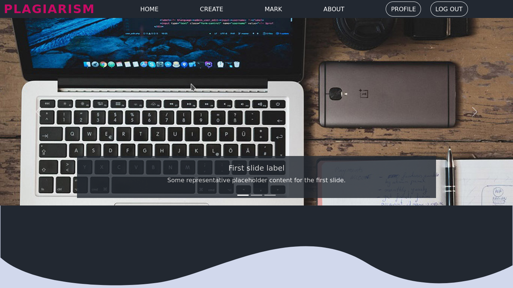
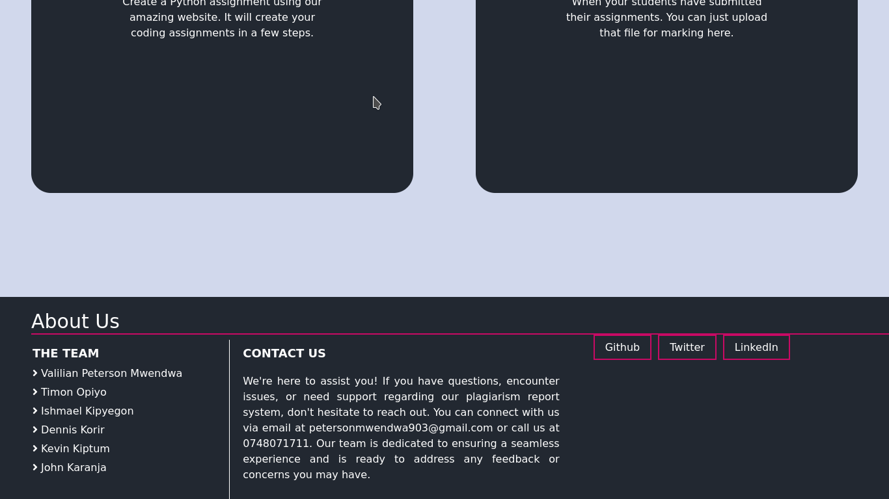
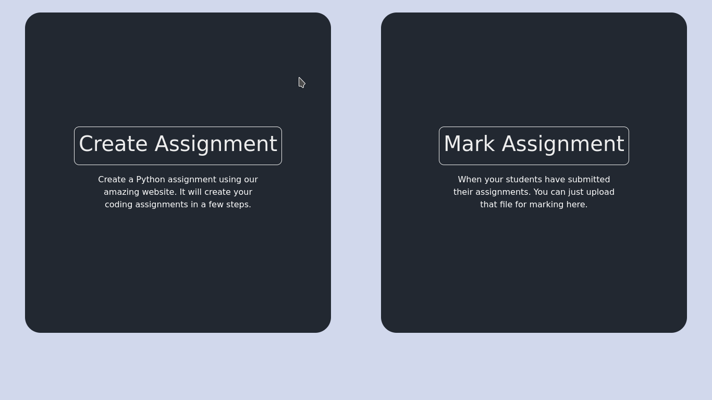
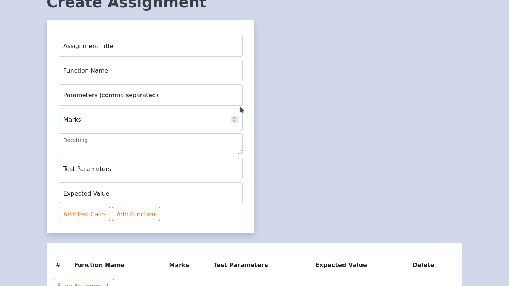
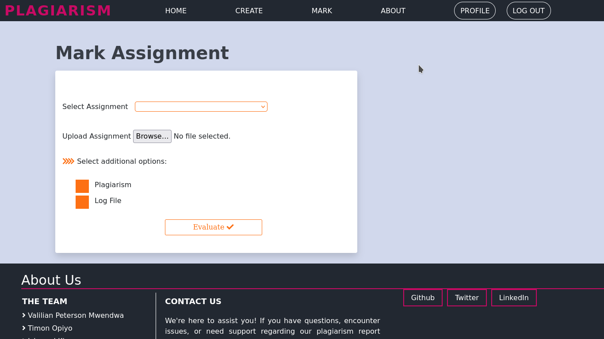

# Plagiarism Detector 📚🔍

 <!-- Replace with your logo -->

## Table of Contents 📑
1. [Introduction](#introduction)
2. [Features](#features)
3. [Installation](#installation)
4. [Usage](#usage)
5. [How It Works](#how-it-works)
6. [Study Background](#study-background)
7. [Contributing](#contributing)
8. [License](#license)
9. [References](#references)

## Introduction 🚀
The Plagiarism Detector is an innovative tool designed to assist teachers and lecturers in evaluating students' responses during exams. This project allows educators to create and upload assessments seamlessly. By analyzing students' submissions, it provides instant feedback on whether the content is plagiarized or original. 

This project aims to enhance academic integrity and foster a culture of originality among students. With the support of advanced algorithms, educators can ensure that assessments are fair and that students are encouraged to express their unique perspectives. 

## Features 🌟
- **User-Friendly Interface:** Intuitive design for easy navigation.
- **Exam Creation & Uploading:** Teachers can create and upload exam questions with ease.
- **Automated Marking:** The system marks students' answers based on predefined criteria.
- **Plagiarism Detection:** Analyzes student submissions to detect plagiarized content.
- **Detailed Reports:** Generates comprehensive reports highlighting originality percentages and potential sources of plagiarism.

## Installation ⚙️
To get started with the Plagiarism Detector, follow these steps:

1. **Clone the repository:**
   ```bash
   git clone https://github.com/yourusername/plagiarism-detector.git
   cd plagiarism-detector
.


# Plagiarism Detector
# 📚 Plagiarism Detector Project

An innovative solution to help educators maintain academic integrity by detecting plagiarism in student submissions. This project, developed from a study at **Meru University of Science and Technology**, provides teachers with tools to create and upload exams, evaluate student answers, and generate detailed plagiarism reports.


**Home page**

**Assignment about**

**Assignment about**

**Create assignment**

**create assignment file**

3rd year project for Meru university Group1 methodology project

To run:

Activate the virtual environment (it might install some packages)

    pipenv shell

Install Flask, Flask-SQLAlchemy.

    pipenv install flask, flask-sqlalchemy

Before running, you must initiate the database by first activating the virtual environment and then execute python shell by the following command:

    drive:/path> python

Then, enter the following commands:

    > from app import db
    > db.create_all()

After this, you can exit the terminal using `exit()`
and then run the following command to run the localhost.

    python app.py

Make sure the virtual environment is activated


---

## 🚀 Usage

Once you've set up the application, open it in your browser:

**URL:** [http://127.0.0.1:5000](http://127.0.0.1:5000)

- **For Teachers:** Log in to create new exams, upload questions, and review student submissions.
- **For Students:** Submit answers and get feedback on the originality of your work.

---

## 🛠️ How It Works

The Plagiarism Detector leverages advanced algorithms to assess originality by scanning a wide range of academic sources and online content. Here’s an overview of its techniques:

- **Text Matching**: Compares word patterns and phrases with existing content.
- **Fingerprinting**: Uses unique identifiers to detect similar structures.
- **Citation Analysis**: Checks citations to assess proper referencing.

Together, these techniques offer a robust and reliable evaluation of student submissions.

---

## 🎓 Study Background

This project builds on findings from Meru University of Science and Technology, where a study identified critical gaps in current plagiarism detection methods. The research underscored the need for technology to support fair and honest academic assessments.

---

## 🤝 Contributing

Your contributions are welcome! To get involved:

1. **Fork the Repository**.
2. **Create a Branch** for your feature:
   ```bash
   git checkout -b feature/YourFeature
## 📄 License

This project is licensed under the **MIT License** 📝. For more details, please refer to the [LICENSE](./LICENSE) file.

## 🔗 References

- **🏫 Meru University of Science and Technology** - Providing the educational background and inspiration behind this project.
- **📂 [GitHub Repository](https://github.com/peterson-Mwendwa/PLagiarism_Detector)** - Access the project code and collaborate with the community.

---


